# Практическое задание: Работа с виртуализацией (VirtualBox)

## Цель
Ознакомиться с технологией виртуализации, научиться создавать и настраивать виртуальные машины с помощью VirtualBox, а также установить и настроить различные операционные системы в виртуальной среде.

## Задание 1: Установка VirtualBox и создание виртуальной машины

### 1. Установка VirtualBox
- Загрузите и установите последнюю версию VirtualBox на ваш компьютер.
- Убедитесь, что VirtualBox успешно запускается и функционирует.
- 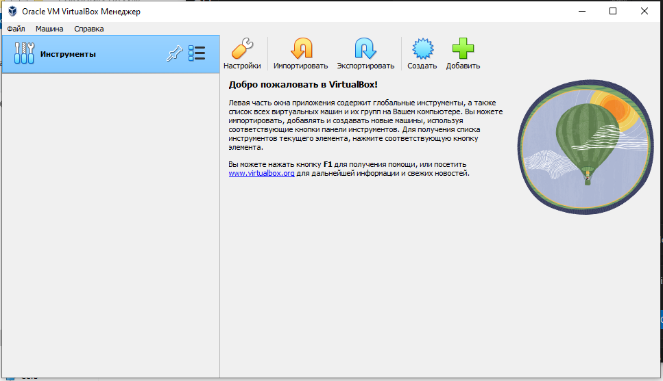

### 2. Создание виртуальной машины
- Создайте новую виртуальную машину для установки операционной системы Mac или Linux (например, Ubuntu).
- Настройте параметры виртуальной машины: назначьте необходимое количество оперативной памяти и создайте виртуальный жесткий диск.
- 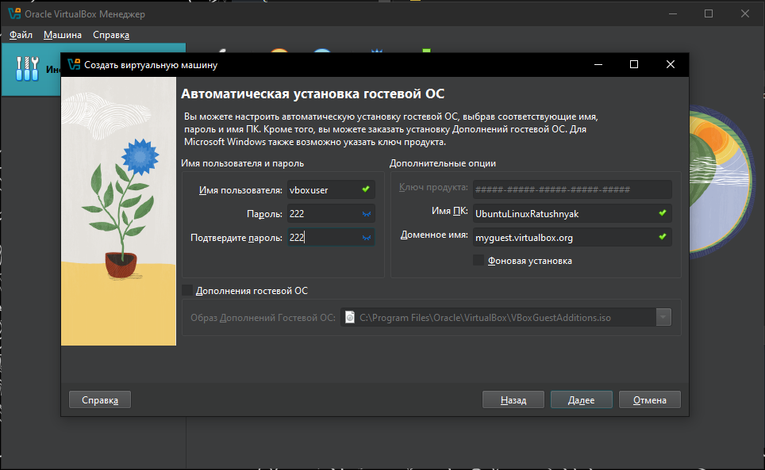
- 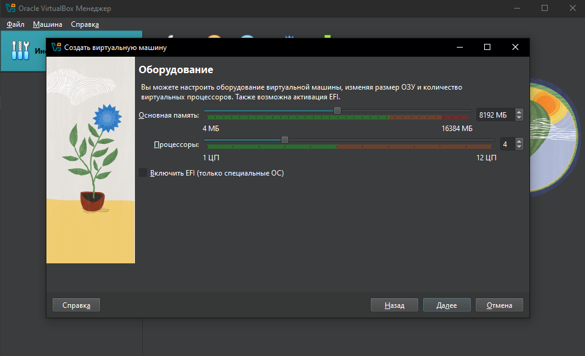
- 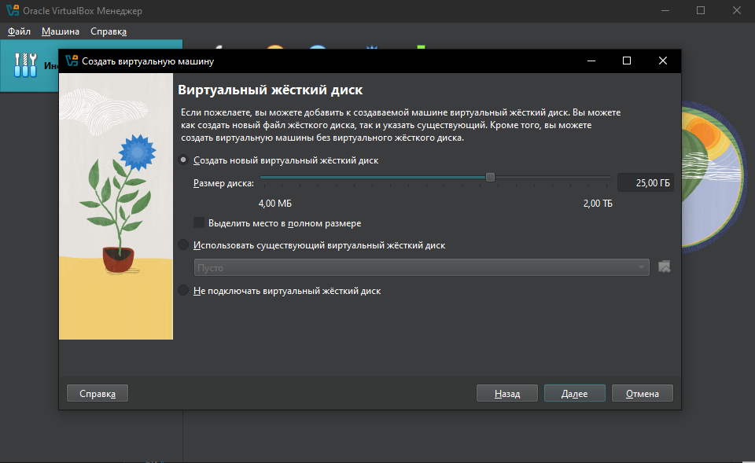
- 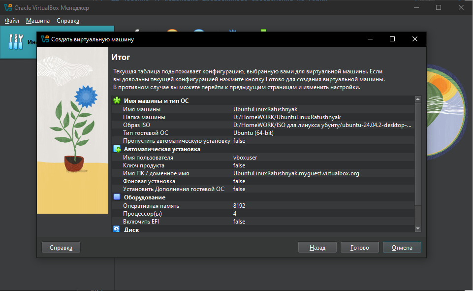

## Задание 2: Установка операционной системы в виртуальной машине

### 1. Установка Mac
- Загрузите образ ISO Mac.
- Установите Mac в созданной виртуальной машине.
- Настройте сетевые подключения и подключите интернет.
- 

### 2. Установка Linux (Ubuntu)
- Загрузите образ ISO Ubuntu.
- Установите Ubuntu в отдельной виртуальной машине.
- Настройте сетевые подключения и подключите интернет.
- 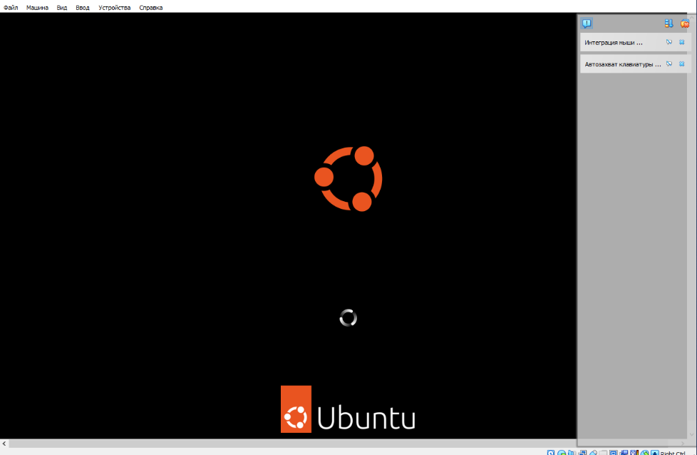
- 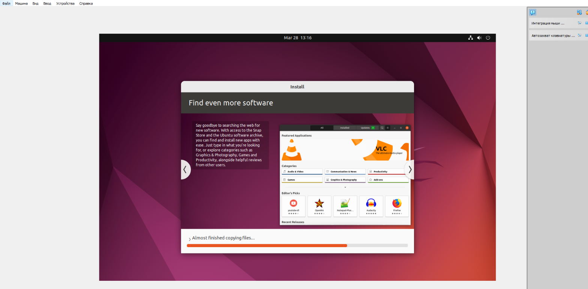
- 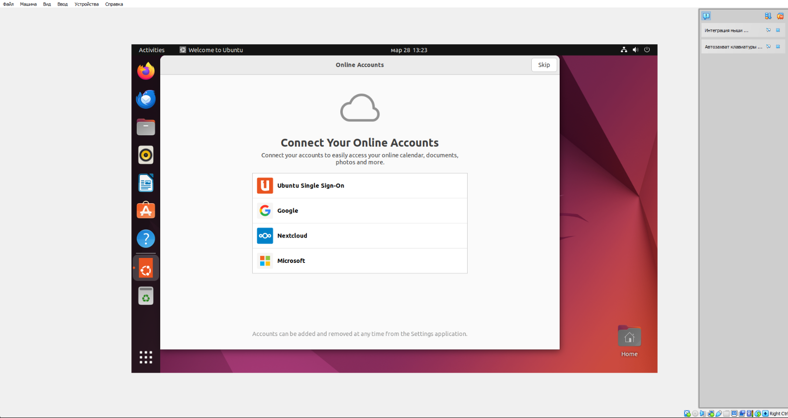
## Задание 3: Настройка и сравнение операционных систем

### 1. Настройка ОС
- Установите необходимые драйверы и обновления для каждой ОС.
- Настройте пользовательский интерфейс и базовые настройки системы.
- 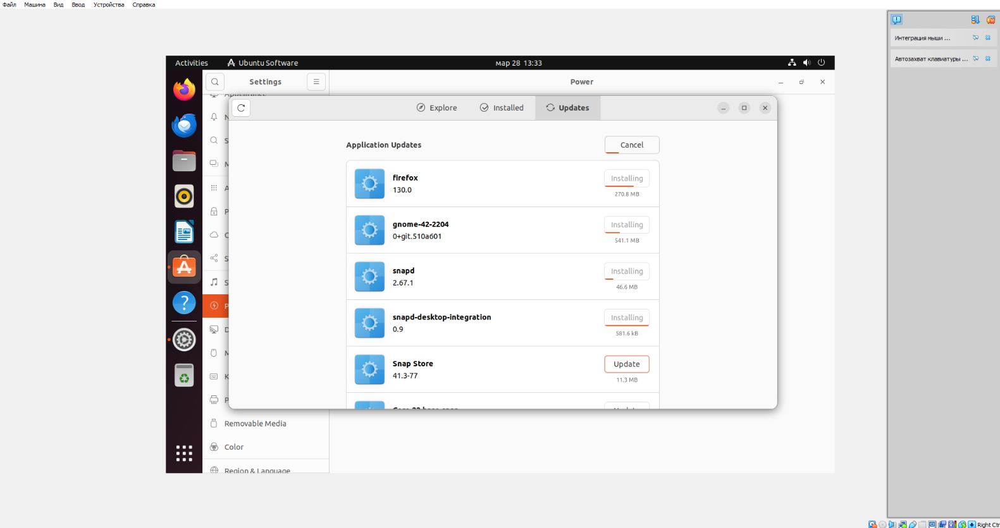
-
-
-

## Сравнительный анализ Mac и Ubuntu в виртуальной среде

### 1. Особенности

- **Mac:**
  - **Интерфейс:** Уникальный и интуитивно понятный интерфейс, привлекательный для пользователей экосистемы Apple.
  - **Экосистема:** Интеграция с устройствами Apple (iPhone, iPad) и облачными сервисами (iCloud).
  - **Программное обеспечение:** Доступ к эксклюзивным приложениям (Final Cut Pro, Logic Pro и др.).

- **Ubuntu:**
  - **Интерфейс:** Гибкий и настраиваемый интерфейс, адаптируемый под различные нужды.
  - **Открытый исходный код:** Возможность модификации и настройки системы.
  - **Программное обеспечение:** Широкий выбор бесплатного и открытого ПО, поддержка пакетов через APT.

### 2. Производительность

- **Mac:**
  - Виртуализация MacOS сложна из-за лицензионных ограничений и требований к оборудованию.
  - Производительность может быть ограничена из-за неполной поддержки аппаратных компонентов.

- **Ubuntu:**
  - Хорошо оптимизирован для виртуальных машин, поддерживается большинством платформ виртуализации.
  - Легкость установки и настройки.

### 3. Удобство использования

- **Mac:**
  - Требует навыков для настройки и установки в виртуальной среде.
  - Может потребоваться дополнительное ПО для эмуляции аппаратных компонентов.

- **Ubuntu:**
  - Простота установки и настройки в виртуальной машине.
  - Широкая поддержка сообщества и документации.

---

## Преимущества и недостатки использования виртуальных машин для работы с разными ОС

### Преимущества:
1. **Изоляция:** Виртуальные машины изолируют ОС, повышая безопасность и стабильность.
2. **Гибкость:** Возможность запуска нескольких ОС на одном физическом компьютере.
3. **Экономия ресурсов:** Уменьшение затрат на оборудование.
4. **Тестирование и разработка:** Удобство для тестирования и разработки ПО.
5. **Резервное копирование и восстановление:** Легкость создания снимков и восстановления состояния.

### Недостатки:
1. **Производительность:** Виртуальные машины могут быть менее производительными по сравнению с физическими.
2. **Ресурсы:** Требуется много оперативной памяти и процессорных ресурсов.
3. **Сложность настройки:** Некоторые ОС требуют сложных настроек для корректной работы.
4. **Лицензионные ограничения:** Некоторые ОС (например, MacOS) имеют ограничения на виртуализацию.

## Задание 4: Настройка сетевых подключений в VirtualBox

### 1. Настройка NAT
- Создайте виртуальную машину с сетевым адаптером, настроенным на NAT.
- Проверьте доступ к интернету из виртуальной машины.
- 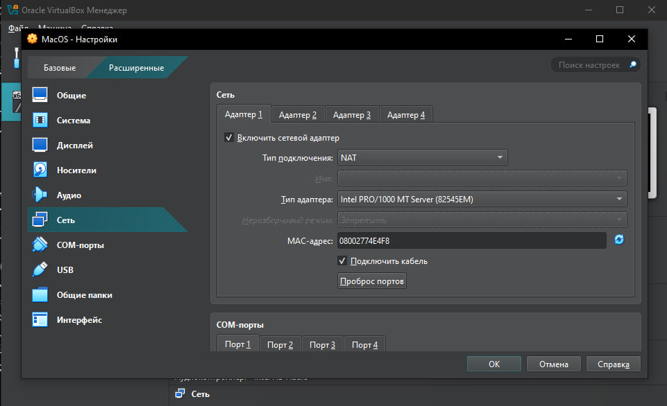

### 2. Настройка Bridged
- Измените сетевой адаптер на Bridged.
- Проверьте доступ к локальной сети и интернету.
- 

## Задание 5: Управление ресурсами виртуальной машины

### 1. Управление оперативной памятью
- Измените объем оперативной памяти, выделенной виртуальной машине.
- Проверьте влияние на производительность.
- 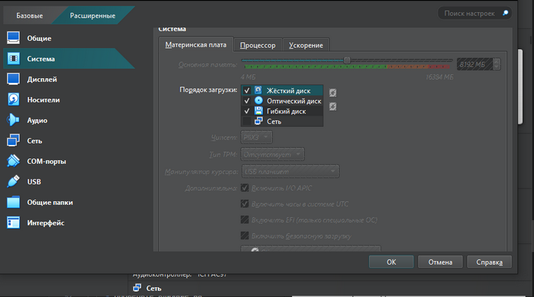

### 2. Управление процессорами
- Измените количество ядер процессора, доступных виртуальной машине.
- Проверьте влияние на производительность.
- 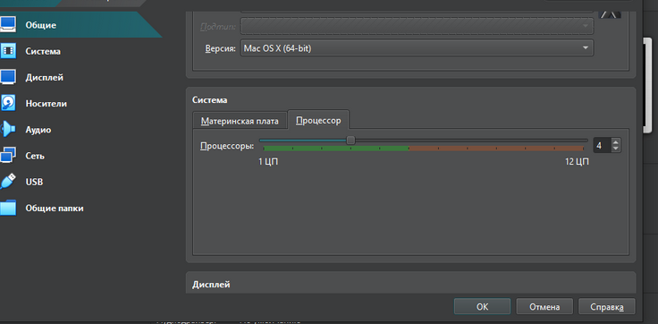

